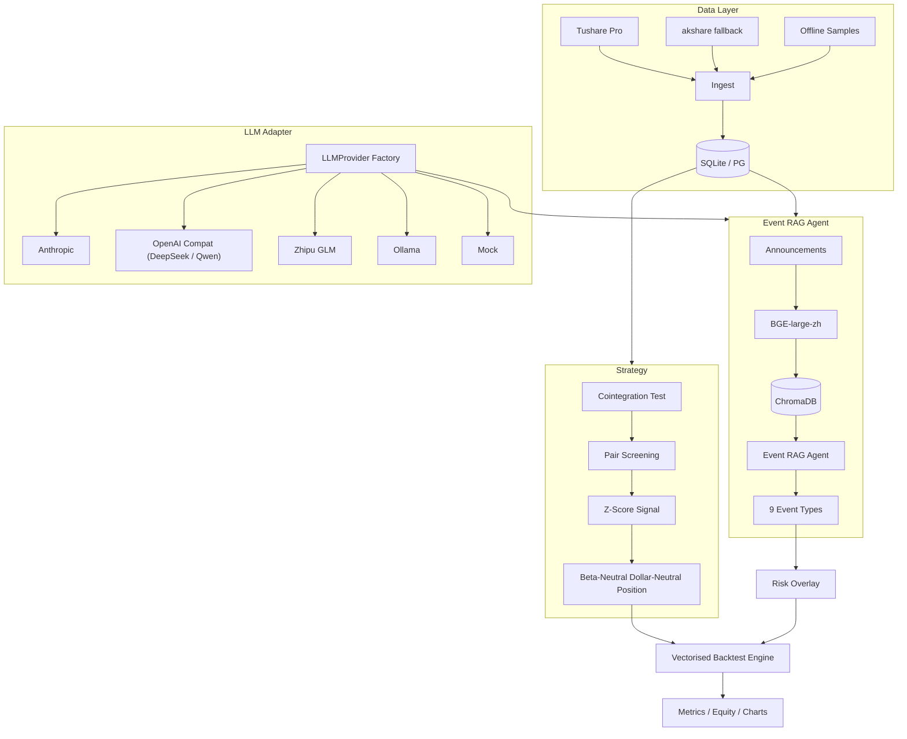

<!--
README - English mirror.  The Chinese (default) version is README.md.
-->

# event-driven-pairs-trading-cn

[](https://github.com/Antonio-cccj/event-driven-pairs-trading-cn/actions/workflows/ci.yml)
[](https://opensource.org/licenses/MIT)
[](https://www.python.org/downloads/)
[](https://github.com/Antonio-cccj/event-driven-pairs-trading-cn/commits/main)

> [中文](README.md) | English

> **Event-driven cointegration pairs trading system for the China A-share market**, with a ChromaDB + BGE-large-zh + LLM-Agent powered RAG risk overlay that classifies announcements into 9 risk-event types.

---

## 1. Why this project?

Classical pairs trading is a market-neutral strategy that exploits mean reversion between two cointegrated assets.  In A-share, however, *idiosyncratic events* (trading suspensions, private placements, regulatory investigations, large-shareholder unloads...) often destroy a cointegration relationship overnight, producing drawdowns that are invisible to a price-only signal.

This repo stitches together:

1. A **classic cointegration + Z-Score** signal engine.
2. A **RAG + LLM Agent** that classifies live announcements into 9 risk-event types.
3. A **configurable risk overlay** that throttles or flattens positions when a risk event hits.

Everything is runnable end-to-end with **zero API credentials** thanks to a built-in mock LLM provider and synthetic OHLCV samples.

## 2. Architecture



## 3. Module map

| Module | Path | Purpose |
|---|---|---|
| Cointegration | `strategy/cointegration.py` | Engle-Granger + Johansen + half-life |
| Pair screening | `strategy/pair_selection.py` | Same-industry combos, p-value + half-life filter |
| Z-Score signal | `strategy/zscore_signal.py` | Open ±2.0σ / Close ±0.5σ / Stop ±3.5σ |
| Position sizing | `strategy/dollar_neutral.py` | Beta-neutral + dollar-neutral |
| Backtest engine | `backtest/engine.py` | Vectorised, daily, multi-pair |
| Cost model | `backtest/costs.py` | 3 bps commission + 10 bps stamp duty + 5 bps slippage |
| Risk overlay | `backtest/risk_overlay.py` | 9 event types throttle / flatten |
| Event agent | `agents/event_rag_agent.py` | RAG retrieval + LLM classification |
| MCP server | `agents/mcp_server.py` | Claude Desktop / Cursor integration |
| LLM adapter | `core/llm/*.py` | Anthropic / OpenAI / DeepSeek / Zhipu / Ollama / Mock |
| Vector store | `core/rag/chroma_store.py` | ChromaDB persistent + numpy fallback |
| Data layer | `core/data/*.py` | Tushare → akshare → samples |

## 4. QuickStart (5 minutes)

```bash
git clone https://github.com/Antonio-cccj/event-driven-pairs-trading-cn.git
cd event-driven-pairs-trading-cn

python -m venv .venv
.venv\Scripts\activate    # Windows
# source .venv/bin/activate  # Linux/Mac
pip install -e ".[dev]"

cp .env.example .env       # fill in keys (or stay on LLM_PROVIDER=mock)

python scripts/init_db.py --use-samples
python scripts/run_backtest.py --use-samples --max-pairs 10

# Optional: launch the MCP server for Claude Desktop / Cursor.
python -m agents.mcp_server
```

**Zero-API mode**: the commands above run fine with `LLM_PROVIDER=mock` and no Tushare token — the system falls back to rule-based event classification + synthetic OHLCV samples.

## 5. API onboarding (pick ANY one LLM provider)

| Service | Required? | URL | Notes |
|---|---|---|---|
| Tushare Pro | optional (akshare fallback) | <https://tushare.pro> | needs 2000+ credits for full A-share OHLCV |
| Anthropic Claude | optional (one of 5) | <https://console.anthropic.com> | overseas billing |
| DeepSeek | optional | <https://platform.deepseek.com> | cheapest China-based LLM |
| Zhipu GLM | optional | <https://open.bigmodel.cn> | `glm-4-flash` free tier |
| Ollama | optional | <https://ollama.com> | local inference, e.g. `qwen2.5:7b` |

Set `LLM_PROVIDER` plus the matching `*_API_KEY` in your `.env`.

## 6. Nine event types

Defined in `agents/event_taxonomy.yaml`:

| Key | Label | Default severity |
|---|---|---|
| suspension | Trading suspension | 1.0 |
| fraud_investigation | Fraud / regulatory probe | 1.0 |
| restructure | Major asset restructuring | 0.7 |
| earnings_warning | Earnings forecast / flash report | 0.7 |
| private_placement | Private placement | 0.5 |
| equity_change | Controlling-shareholder change | 0.5 |
| litigation | Major litigation | 0.5 |
| shareholder_reduction | Insider sell-down | 0.4 |
| other | Routine announcements | 0.1 |

See [`docs/methodology.md`](docs/methodology.md) for the full prompt + decision logic.

## 7. Outputs

After `python scripts/run_backtest.py --use-samples`, artefacts land in `reports/output/`:

- `metrics.json` — performance summary
- `equity.csv` / `equity.png` — NAV curve
- `returns.csv` — daily returns
- `positions.csv` — per-pair signed positions

> **Disclaimer**: example performance numbers are from synthetic data + default parameters.  They demonstrate the pipeline, **not** real out-of-sample performance, and are **not** investment advice.

## 8. Directory layout

```
event-driven-pairs-trading-cn/
├── core/                # shared: config / logger / data / llm / rag
├── strategy/            # cointegration + pair selection + signals + sizing
├── backtest/            # engine, costs, metrics, risk overlay
├── agents/              # event RAG agent + MCP server + taxonomy
├── scripts/             # CLI entry points
├── tests/               # pytest (unit + smoke)
├── notebooks/           # 3 example notebooks
├── docs/                # architecture / methodology / results / mcp_usage
├── config/              # defaults + universe.yaml
├── .github/workflows/   # CI: ruff + pytest + smoke
├── pyproject.toml       # PEP 621 packaging
└── .env.example         # all API placeholders
```

## 9. Roadmap

- [x] Phase 0–6: scaffolding, shared core, strategy, agent, tests, CI
- [x] Phase 7: bilingual README + notebooks + docs
- [ ] Live Tushare anns_d + CNINFO scraper hookup
- [ ] LightGBM signal-filter layer
- [ ] Streamlit Web UI

## 10. Citation

```bibtex
@software{chu2026edpt,
  author    = {Chu, Jun},
  title     = {event-driven-pairs-trading-cn: An event-driven pairs trading system with LLM RAG risk overlay},
  year      = {2026},
  url       = {https://github.com/Antonio-cccj/event-driven-pairs-trading-cn}
}
```

## 11. License

[MIT License](LICENSE) © 2026 [Antonio-cccj](https://github.com/Antonio-cccj) (Jun Chu)
