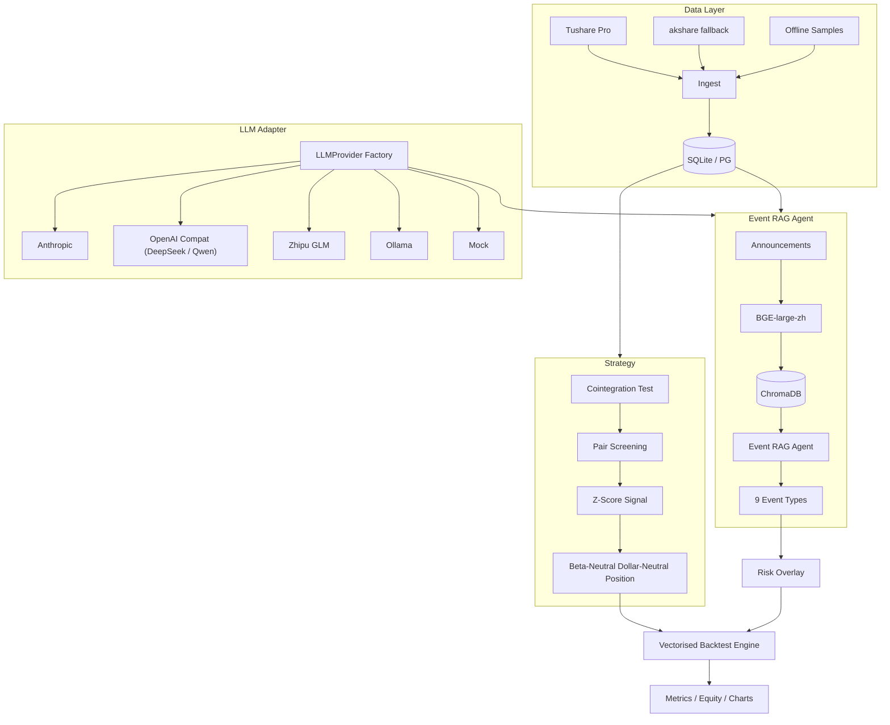

<!--
README - Chinese (default).
The mirrored English version lives at README.en.md.
Please keep both in sync when editing.
-->

# event-driven-pairs-trading-cn

[](https://github.com/Antonio-cccj/event-driven-pairs-trading-cn/actions/workflows/ci.yml)
[](https://opensource.org/licenses/MIT)
[](https://www.python.org/downloads/)
[](https://github.com/Antonio-cccj/event-driven-pairs-trading-cn/commits/main)

> 中文 | [English](README.en.md)

> **事件驱动的 A 股协整配对交易系统** —— 基于协整检验 + Z-Score 阈值的配对交易，叠加由 ChromaDB + BGE-large-zh + LLM Agent 构成的 RAG 公告事件识别风险层。

---

## 一、项目背景

成对交易（Pairs Trading）是经典的市场中性策略，但 A 股市场的 *事件驱动* 风险（停牌、定增、立案、减持等）会让原本稳定的协整关系突然失效，导致策略回撤。本项目把：

1. **传统协整 + Z-Score** 信号引擎
2. **基于 RAG + LLM Agent** 的公告事件实时识别
3. **可配置的风险叠加层**

整合到一个可端到端运行的开源框架中，让读者既能复现量化策略的基础回测，也能体验 *如何用大模型给传统量化策略做风险风控加层*。

## 二、整体架构



## 三、核心模块

| 模块 | 文件 | 描述 |
|---|---|---|
| 协整检验 | `strategy/cointegration.py` | Engle-Granger + Johansen + 半衰期估计 |
| 配对筛选 | `strategy/pair_selection.py` | 行业内成对组合，p-value 与半衰期过滤 |
| Z-Score 信号 | `strategy/zscore_signal.py` | 开仓 ±2.0σ / 平仓 ±0.5σ / 止损 ±3.5σ |
| 仓位构建 | `strategy/dollar_neutral.py` | Beta 中性 + Dollar-Neutral |
| 回测引擎 | `backtest/engine.py` | 向量化日频，多对组合 |
| 成本模型 | `backtest/costs.py` | 万三佣金 + 千一印花税 + 5bp 滑点 |
| 风险叠加 | `backtest/risk_overlay.py` | 9 类事件触发减仓/平仓 |
| 事件 Agent | `agents/event_rag_agent.py` | RAG 检索 + LLM 分类 |
| MCP Server | `agents/mcp_server.py` | 对接 Claude Desktop / Cursor |
| LLM 抽象 | `core/llm/*.py` | Anthropic / OpenAI / DeepSeek / Zhipu / Ollama / Mock |
| 向量库 | `core/rag/chroma_store.py` | ChromaDB 持久化 + numpy fallback |
| 数据层 | `core/data/*.py` | Tushare → akshare → 离线样本三级 fallback |

## 四、快速开始（5 分钟）

```bash
# 1. 克隆
git clone https://github.com/Antonio-cccj/event-driven-pairs-trading-cn.git
cd event-driven-pairs-trading-cn

# 2. 安装（推荐 Python 3.10–3.12）
python -m venv .venv
.venv\Scripts\activate    # Windows
# source .venv/bin/activate # Linux/Mac
pip install -e ".[dev]"

# 3. 拷贝并填写环境变量
cp .env.example .env
# 编辑 .env，至少填一项 LLM_PROVIDER（mock 也可以）

# 4. 用内置样本数据初始化数据库 + 跑回测
python scripts/init_db.py --use-samples
python scripts/run_backtest.py --use-samples --max-pairs 10

# 5. （可选）启动 MCP Server 给 Claude Desktop / Cursor 用
python -m agents.mcp_server
```

**完全无 API 模式**：上面的命令在 `LLM_PROVIDER=mock` 与无 Tushare token 时也能跑通——使用规则式事件分类 + 合成 OHLCV 样本。

## 五、API 申请指引

| 服务 | 是否必填 | 申请地址 | 备注 |
|---|---|---|---|
| **Tushare Pro** | 否（有 akshare 兜底） | <https://tushare.pro> | 注册后积分 ≥ 2000 可拉全市场行情 |
| **Anthropic Claude** | 否（5 选 1） | <https://console.anthropic.com> | 海外信用卡 |
| **DeepSeek** | 否 | <https://platform.deepseek.com> | 国内 LLM，性价比高 |
| **Zhipu GLM** | 否 | <https://open.bigmodel.cn> | `glm-4-flash` 有免费额度 |
| **Ollama** | 否 | <https://ollama.com> | 本地推理，推荐 `qwen2.5:7b` |

在 `.env` 中只设置 `LLM_PROVIDER=<provider 名>` + 对应的 `*_API_KEY` 即可切换后端。

## 六、9 类风险事件分类

由 `agents/event_taxonomy.yaml` 定义，详见 [`docs/methodology.md`](docs/methodology.md)：

| key | 中文 | 默认严重度 |
|---|---|---|
| suspension | 停牌 | 1.0 |
| fraud_investigation | 财务造假/证监会立案 | 1.0 |
| restructure | 重大资产重组 | 0.7 |
| earnings_warning | 业绩预告/快报 | 0.7 |
| private_placement | 定增/非公开发行 | 0.5 |
| equity_change | 实控人变更 | 0.5 |
| litigation | 重大诉讼 | 0.5 |
| shareholder_reduction | 股东减持 | 0.4 |
| other | 其他 | 0.1 |

## 七、示例输出（样本数据）

跑一次 `python scripts/run_backtest.py --use-samples` 之后，工件落在 `reports/output/`：

- `metrics.json` —— 业绩指标
- `equity.csv` / `equity.png` —— 净值曲线
- `returns.csv` —— 每日收益
- `positions.csv` —— 长格式仓位明细

> **声明**：示例业绩为合成数据 + 默认参数运行结果，**仅用于演示流程**，不代表样本外真实业绩，不构成投资建议。

## 八、目录结构

```
event-driven-pairs-trading-cn/
├── core/                # 共享底座：config / logger / data / llm / rag
├── strategy/            # 协整 + 配对 + Z-Score + 仓位
├── backtest/            # 回测引擎、成本、指标、风险叠加
├── agents/              # 事件 RAG Agent + MCP Server + 9 类事件分类
├── scripts/             # CLI: init_db / run_backtest / run_event_agent
├── tests/               # pytest（关键模块 + smoke test）
├── notebooks/           # 03 个示例 Notebook
├── docs/                # architecture / methodology / results / mcp_usage
├── config/              # 默认参数 + universe.yaml
├── .github/workflows/   # CI: ruff + pytest + smoke
├── pyproject.toml       # 现代 PEP 621 打包
└── .env.example         # 所有 API 占位符
```

## 九、Roadmap

- [x] Phase 0–6：脚手架、底座、策略、Agent、测试、CI
- [x] Phase 7：双语 README + Notebooks + docs
- [ ] 接入真实 Tushare anns_d / 巨潮爬虫
- [ ] LightGBM 信号筛选层
- [ ] Web UI：Streamlit 实时跟踪

## 十、引用

如果这个项目对你的研究有帮助，请考虑引用：

```bibtex
@software{chu2026edpt,
  author    = {Chu, Jun},
  title     = {event-driven-pairs-trading-cn: An event-driven pairs trading system with LLM RAG risk overlay},
  year      = {2026},
  url       = {https://github.com/Antonio-cccj/event-driven-pairs-trading-cn}
}
```

## 十一、License

[MIT License](LICENSE) © 2026 [Antonio-cccj](https://github.com/Antonio-cccj) (Jun Chu)
