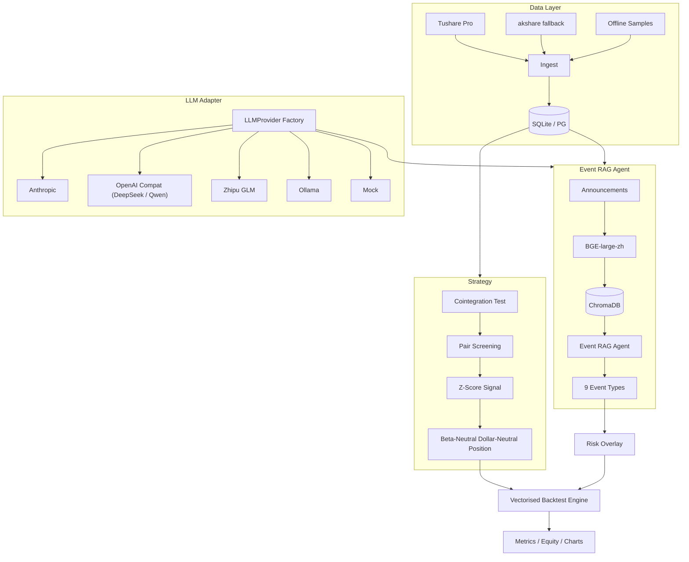

<!--
README - default English version.
-->

# a-share-pairs-agent

[](https://github.com/Antonio-cccj/a-share-pairs-agent/actions/workflows/ci.yml)
[](https://opensource.org/licenses/MIT)
[](https://www.python.org/downloads/)
[](https://github.com/Antonio-cccj/a-share-pairs-agent/commits/main)

> English | [简体中文](README.zh.md)

> **Event-aware A-share cointegration pairs trading agent** with a ChromaDB + BGE-large-zh + LLM Agent powered announcement risk overlay.

---

## 1. Project Overview

Pairs trading is a classic market-neutral strategy, but in A-share markets, event shocks (suspensions, regulatory probes, shareholder sell-downs, private placements) can break cointegration relationships abruptly.  
This project combines:

1. A **cointegration + Z-score** signal engine
2. A **RAG + LLM announcement intelligence agent**
3. A **risk overlay** that can cut or flatten exposure

The repository is built to run end-to-end with sample data and a mock LLM, so readers can evaluate your Agent architecture and workflow design without API keys.

## 2. Architecture



## 3. Core Modules

| Module | Path | Purpose |
|---|---|---|
| Cointegration | `strategy/cointegration.py` | Engle-Granger + Johansen + half-life |
| Pair screening | `strategy/pair_selection.py` | Same-industry pair candidates + p-value/half-life filters |
| Z-score signal | `strategy/zscore_signal.py` | Open ±2.0 sigma / Close ±0.5 sigma / Stop ±3.5 sigma |
| Position sizing | `strategy/dollar_neutral.py` | Beta-neutral + dollar-neutral |
| Backtest engine | `backtest/engine.py` | Vectorized daily multi-pair backtest |
| Cost model | `backtest/costs.py` | 3 bps commission + 10 bps stamp duty + 5 bps slippage |
| Risk overlay | `backtest/risk_overlay.py` | Event-aware exposure throttle and flatten |
| Event agent | `agents/event_rag_agent.py` | RAG retrieval + LLM classification |
| MCP server | `agents/mcp_server.py` | Claude Desktop / Cursor integration |
| LLM adapter | `core/llm/*.py` | Anthropic / OpenAI / DeepSeek / Zhipu / Ollama / Mock |
| Vector store | `core/rag/chroma_store.py` | ChromaDB persistent + numpy fallback |
| Data layer | `core/data/*.py` | Tushare -> akshare -> sample fallback |

## 4. Quick Start (5 minutes)

```bash
# 1. Clone
git clone https://github.com/Antonio-cccj/a-share-pairs-agent.git
cd a-share-pairs-agent

# 2. Install (Python 3.10-3.12 recommended)
python -m venv .venv
.venv\Scripts\activate    # Windows
# source .venv/bin/activate # Linux/Mac
pip install -e ".[dev]"

# 3. Copy env and fill credentials if needed
cp .env.example .env
# You can keep LLM_PROVIDER=mock for zero-API run

# 4. Run sample pipeline
python scripts/init_db.py --use-samples
python scripts/run_backtest.py --use-samples --max-pairs 10

# 5. Optional: launch MCP server
python -m agents.mcp_server
```

**Zero-API mode**: this works with `LLM_PROVIDER=mock` and no Tushare token.

## 5. API Onboarding

| Service | Required | URL | Notes |
|---|---|---|---|
| Tushare Pro | Optional | <https://tushare.pro> | akshare fallback is available |
| Anthropic Claude | Optional | <https://console.anthropic.com> | |
| DeepSeek | Optional | <https://platform.deepseek.com> | |
| Zhipu GLM | Optional | <https://open.bigmodel.cn> | |
| Ollama | Optional | <https://ollama.com> | local inference |

Set `LLM_PROVIDER` and matching `*_API_KEY` values in `.env`.

## 6. Nine Event Types

Defined in `agents/event_taxonomy.yaml`, see [`docs/methodology.md`](docs/methodology.md):

| key | label | default severity |
|---|---|---|
| suspension | trading suspension | 1.0 |
| fraud_investigation | fraud or regulatory probe | 1.0 |
| restructure | major restructuring | 0.7 |
| earnings_warning | earnings warning | 0.7 |
| private_placement | private placement | 0.5 |
| equity_change | controlling shareholder change | 0.5 |
| litigation | major litigation | 0.5 |
| shareholder_reduction | major holder reduction | 0.4 |
| other | routine announcements | 0.1 |

## 7. Sample Outputs

After `python scripts/run_backtest.py --use-samples`, artifacts are saved in `reports/output/`:

- `metrics.json` - performance metrics
- `equity.csv` / `equity.png` - equity curve
- `returns.csv` - daily returns
- `positions.csv` - long-format positions

> Disclaimer: sample performance uses synthetic data and default parameters for demonstration only.

## 8. Directory Layout

```
a-share-pairs-agent/
├── core/                # shared: config / logger / data / llm / rag
├── strategy/            # cointegration + pair selection + signal + sizing
├── backtest/            # engine, costs, metrics, risk overlay
├── agents/              # event RAG agent + MCP server + taxonomy
├── scripts/             # init_db / run_backtest / run_event_agent
├── tests/               # pytest unit + smoke
├── notebooks/           # example notebooks
├── docs/                # architecture / methodology / results / mcp_usage
├── .github/workflows/   # CI
├── pyproject.toml
└── .env.example
```

## 9. Roadmap

- [x] Core scaffold, strategy, agent, tests, CI
- [x] Documentation and notebooks
- [ ] Live Tushare anns_d / CNINFO integration
- [ ] LightGBM signal filter layer
- [ ] Streamlit web UI

## 10. Citation

```bibtex
@software{chu2026edpt,
  author    = {Chu, Jun},
  title     = {a-share-pairs-agent: Event-aware A-share pairs trading agent with LLM RAG risk overlay},
  year      = {2026},
  url       = {https://github.com/Antonio-cccj/a-share-pairs-agent}
}
```

## 11. License

[MIT License](LICENSE) © 2026 [Antonio-cccj](https://github.com/Antonio-cccj) (Jun Chu)
