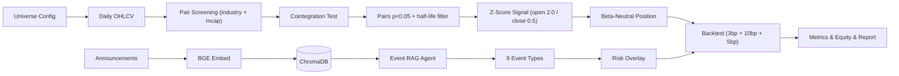

# 架构总览 / Architecture Overview

> Bilingual reference: this document is a deep dive into the data flow,
> module boundaries, and key design decisions.  English follows the Chinese
> section for each subsection.

## 1. 数据流 / Data flow

- 数据层：Tushare → akshare → 样本数据三级 fallback。
- 策略层：协整 → Z-Score → 仓位。
- Agent 层：BGE 检索 + LLM 分类 → 风险叠加。
- 回测层：向量化日频，3bp 佣金 + 10bp 印花税 + 5bp 滑点。

## 2. 模块边界 / Module boundaries

- `core/` 不依赖 `strategy/` / `agents/` / `backtest/`。
- `strategy/` 只依赖 `core/`。
- `backtest/` 只依赖 `core/` 与 `strategy/`。
- `agents/` 依赖 `core/`，可选依赖 `backtest/`（用于把事件输出给回测）。

这样保证每一层都可以独立单测，互不阻塞。

## 3. 设计决策 / Design decisions

### 3.1 为什么 SQLite + SQLAlchemy 默认？

部署门槛最低、单文件、无运维。需要并发时可在 `.env` 切换到
`postgresql+psycopg://...` 即可。

### 3.2 为什么 Engle-Granger + Johansen 双检验？

EG 检验快、适合大规模筛选；Johansen 给出系统性证据，作为交叉验证。
当 statsmodels 老版本缺少 Johansen 接口时，单 EG 也能跑通。

### 3.3 为什么需要 MockLLM？

无 API key 时不能让 import 直接 crash，CI 也需要在零密钥环境通过。
规则式分类虽然粗糙，但对九类事件的代表性公告均能正确归类。

### 3.4 为什么 Risk Overlay 在“信号之后、仓位之前”？

为了让事件只影响新仓位 / 退出已有仓位，永远不深化暴露。
