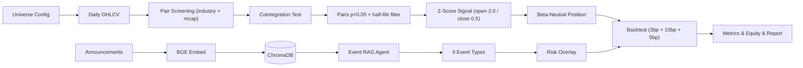

# Architecture Overview

## 1. Data flow

- Data layer: Tushare -> akshare -> sample data fallback.
- Strategy layer: cointegration -> Z-score -> position sizing.
- Agent layer: BGE retrieval + LLM classification -> risk overlay.
- Backtest layer: vectorized daily engine with 3 bps commission, 10 bps stamp duty, 5 bps slippage.

## 2. Module boundaries

- `core/` is shared and does not depend on strategy/backtest/agents.
- `strategy/` depends on `core/`.
- `backtest/` depends on `core/` and `strategy/`.
- `agents/` depends on `core/` and optionally integrates with `backtest/`.

This separation keeps testability high and avoids circular coupling.

## 3. Design decisions

### 3.1 Why SQLite + SQLAlchemy by default?

Lowest setup cost and single-file portability. Users can switch to PostgreSQL via `.env`.

### 3.2 Why Engle-Granger + Johansen?

Engle-Granger is fast for broad pair screening, while Johansen gives system-level confirmation.
If a runtime environment lacks Johansen support, Engle-Granger still provides a robust fallback.

### 3.3 Why MockLLM?

The project must run without secrets in CI and on first-time local setup.
MockLLM provides deterministic behavior so the end-to-end flow remains demonstrable.

### 3.4 Why place Risk Overlay between signal and final execution?

Risk events should reduce or flatten exposure before capital is committed further.
This design ensures events never amplify risk unintentionally.
